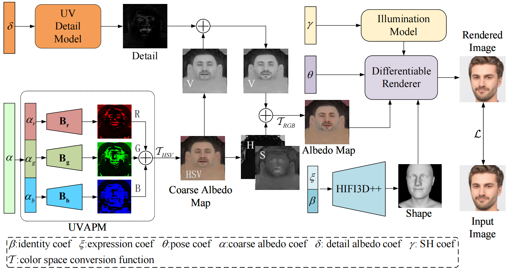
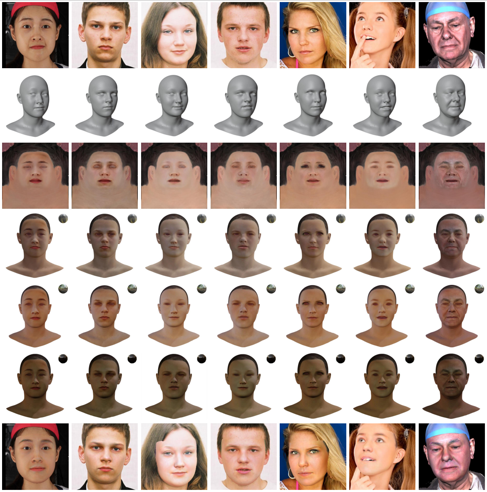

# High-Quality Facial Albedo Generation for 3D Face Reconstruction from a Single Image using a Coarse-to-Fine Approachs

This repository contains the implementation of our paper **"High-Quality Facial Albedo Generation for 3D Face Reconstruction from a Single Image using a Coarse-to-Fine Approach"**. Our method generates high-fidelity UV albedo maps from a single image, enabling realistic 3D face reconstruction with detailed textures. The code and pre-trained models are publicly available to facilitate further research and reproducibility.

## Table of Contents
- [Introduction](#introduction)
- [Method Overview](#method-overview)
- [Installation](#installation)
- [Usage](#usage)
- [Results](#results)
- [Citation](#citation)
- [Acknowledgements](#acknowledgements)

## Introduction

High-fidelity 3D face reconstruction from a single image is a challenging task in computer vision. While significant progress has been made in shape reconstruction, generating realistic facial textures with high-frequency details remains a major challenge. This paper proposes a novel **coarse-to-fine approach** for UV albedo map generation, which combines a **UV Albedo Parametric Model (UVAPM)** with a **detail generator** to produce high-quality facial textures from a single image.

Our method outperforms existing approaches in terms of texture quality and realism, making it suitable for applications in VR/AR, face recognition, and animation.

## Method Overview

Our method consists of three main stages:

1. **Coarse Albedo Generation**: We use a UV Albedo Parametric Model (UVAPM) to generate low-resolution albedo maps with basic skin tones and low-frequency details.
2. **Detail Generation**: A detail generator, trained using a Variational Auto-Encoder (VAE), is employed to add high-frequency details such as wrinkles, whiskers, and spots.
3. **Rendering**: The final albedo map is rendered using a differentiable renderer, producing realistic 3D face models.

The pipeline is illustrated in the figure below:



## Installation

To install the required dependencies, follow these steps:

1. Clone this repository:
   ```bash
   git clone https://github.com/MVIC-DAI/UVAPM.git
   cd UVAPM
   ```

2. Install the required Python packages:
   ```bash
   pip install -r requirements.txt
   ```

3.  [Download](https://pan.baidu.com/s/1O8ycthPabmVTEP9OZSkrtQ?pwd=MVIC) the pre-trained models and checkpoints, place them in the `checkpoints/` directory. The models are placed in the following paths.

```
checkpoints  
├─arcface_model
│      ms1mv3_arcface_r50_fp16_backbone.pth
│      
├─deep3d_model
│      epoch_latest.pth
│      
├─detail_model
│      autoencoder_model.pth
│      variational_autoencoder.pth
│      
├─dlib_model
│      shape_predictor_68_face_landmarks.dat
│      
├─dpr_model
│      trained_model_03.t7
│      
├─e4e_model
│      e4e_ffhq_encode.pt
│      
├─exprecog_model
│      FacialExpRecognition_model.t7
│      
├─lm_model
│      68lm_detector.pb
│      
├─mtcnn_model
│      mtcnn_model.pb
│      
├─parsing_model
│      79999_iter.pth
│      
├─resnet_model
│      resnet18-5c106cde.pth
│      
└─vgg_model
        vgg16.pt
```


## Usage

### 1. Generating UV Albedo Maps

To generate a UV albedo map from a single image, run the following command:

```bash
bash run_rgb_fitting.sh
```

### 2. Training the Detail Generator

To train the detail generator on your own dataset, use the following command:

```bash
python train_detail_generator.py --dataset_path path/to/dataset --epochs 50 --batch_size 32
```

### 3. Rendering 3D Faces

To render a 3D face model using the generated albedo map, run:

```bash
python render_3d_face.py --albedo_map path/to/albedo_map.png --output_path path/to/save/render
```
The code will be uploaded after the article is officially accepted.
## Results

Our method generates high-quality UV albedo maps with fine details, as shown in the examples below:



For more detailed results and comparisons with state-of-the-art methods, please refer to the [paper](#citation).

## Citation

If you find this work useful in your research, please consider citing our paper:

```bibtex
@inproceedings{Dai2025HighQualityFA,
  title={High-Quality Facial Albedo Generation for 3D Face Reconstruction from a Single Image using a Coarse-to-Fine Approach},
  author={Jiashu Dai and Along Wang and Binfan Ni and Tao Cao},
  year={2025},
  url={https://api.semanticscholar.org/CorpusID:279402064}
}
```

## Acknowledgements

This work was supported by the Natural Science Research in Colleges and Universities of Anhui Province of China under Grant No. KJ2020A0362.

---

For any questions or issues, please open an issue on GitHub or contact the authors directly.
